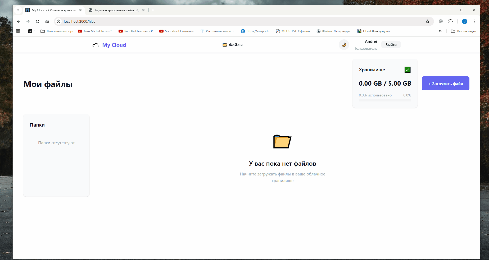

# Дипломный проект по профессии «Fullstack-разработчик на Python»

## Установка после клонирования репозитория

### backend

```
cd backend
python -m venv env
env/Scripts/activate
pip install -r requirements.txt
python manage.py migrate
python manage.py runserver

```

### frontend

```
cd frontend
npm install
npm start

```

## Деплой


